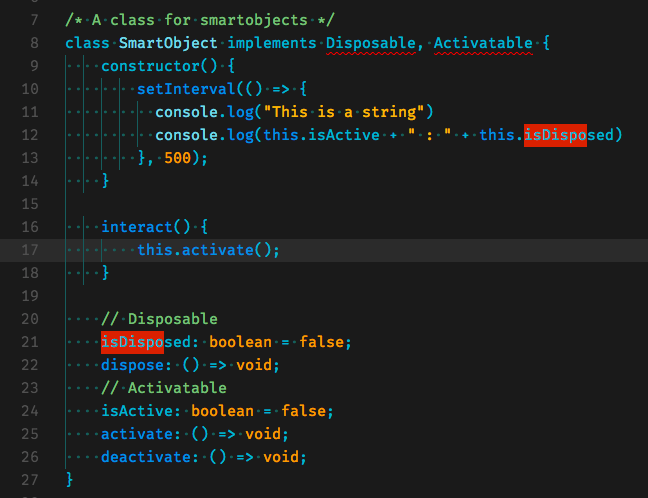

# Goodvibe for Visual Studio Code

This theme has been developed while using it with TypeScript and JavaScript. I am not sure how it'd be like with other languages.

## Screenshot


Please note that screenshot is taken while using these settings:

```
  "editor.renderWhitespace": "all",
	"editor.fontFamily": "Fira Mono",
	"editor.fontSize": 14,
```

## Features

That's the list of things I wanted to focus on while developing Goodvibe:

- Strings and numbers must be strongly pointed out
- Comments must pop out
- During a search, the highlighted matches must be _really_ highlighted 
- Colors should use a known palette (Material UI)

## Installation

### Cloning the Repository

Change to your Visual Studio Code extensions directory:

```bash
# Windows
$ cd %USERPROFILE%\.vscode\extensions

# Linux & macOS
$ cd ~/.vscode/extensions/
```

Clone repository as `goodvibe`:

```bash
$ git clone https://github.com/claudioc/vscode-goodvibe claudioc.goodvibe
```

Now you can select this theme from the Theme selector in VSC

## License

This work is licensed under the MIT license
